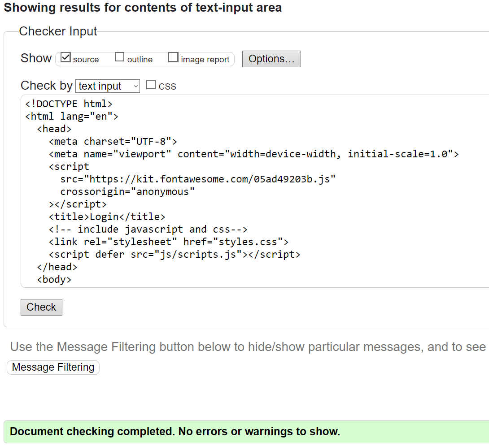
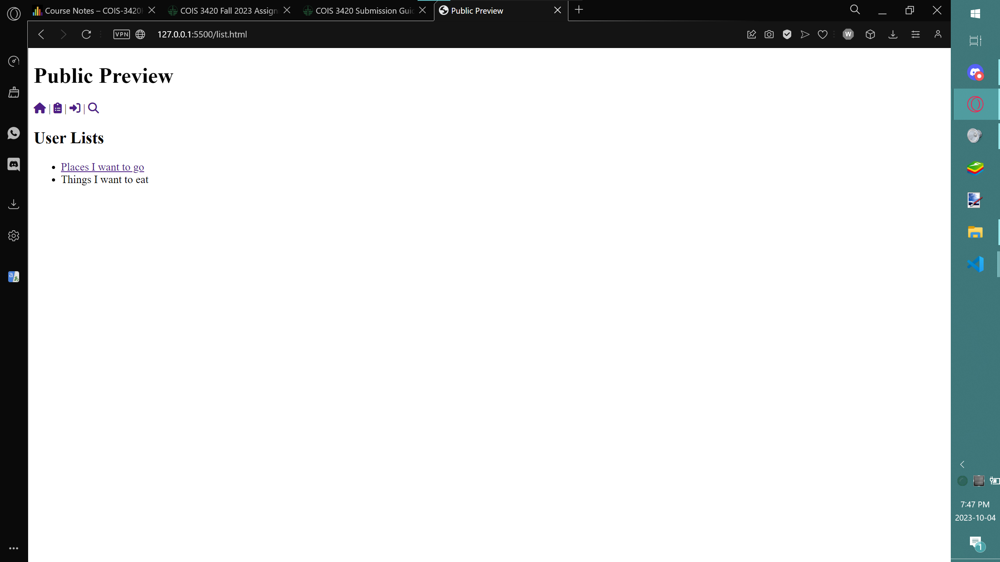

# 3420 Assignment #1 - Fall 2023

Names: Farzad Imran (0729901) Akash Bahl (0740368)

Live Loki link(s):
<https://loki.trentu.ca/~demiimran/3420/assn/assn1/>
## Rubric

| Component                                           | Grade |
| :-------------------------------------------------- | ----: |
| Overall Page Structures (header, footer, nav, etc ) |    /2 |
|                                                     |       |
| Create Account                                      |    /2 |
| Login                                               |    /2 |
| Forgot Password                                     |    /2 |
| Main Page                                           |    /3 |
| Edit List Item                                      |    /2 |
| View List Item                                      |    /2 |
| Public List                                         |    /2 |
| Search                                              |    /2 |
| Form Element Variety                                |    /3 |
|                                                     |       |
| Accessibility                                       |    /3 |
| Code Quality (readability, tidyness)                |    /2 |
| Documentation                                       |    /3 |
| Testing                                             |    /3 |
|                                                     |       |
| Deductions (submission guidelines, originality)     |       |
|                                                     |       |
| Total                                               |   /33 |

*all individual page grades are evaluated based on if the page meets the requirements outlined in the assignment details,  HTML validity, and the sematics of your HTML choices 

## Create Account

### HTML

```html
<!DOCTYPE html>
<html lang="en">
  <head>
    <meta charset="UTF-8">
    <meta name="viewport" content="width=device-width, initial-scale=1.0">
    <script
      src="https://kit.fontawesome.com/05ad49203b.js"
      crossorigin="anonymous"
    ></script>
    <title>Register</title>
    <!-- include javascript and css-->
    <link rel="stylesheet" href="styles.css">
    <script defer src="js/scripts.js"></script>
  </head>
  <body>
    <header>
      <!--This will be the main heading of the page so users know what page they're on-->
      <h1>Create An Account</h1>

      <nav>
        <!-- The following nav will be a bar at the top of the webpage so users can visit the desired page-->
        <a href="index.html"><i class="fa-solid fa-house"></i></a> |
        <a href="list.html"><i class="fa-solid fa-clipboard-list"></i></a> |
        <a href="login.html"><i class="fa-solid fa-right-to-bracket"></i></a> |
        <a href="search.html"><i class="fa-solid fa-magnifying-glass"></i></a>
      </nav>
    </header>
    <main>
      <form action="create-account.php" method="post">
        <fieldset>
          <legend>Account Information</legend>
          <div>
            <label for="name">Name:</label>
            <input type="text" id="name" name="name" required>
          </div>
          <div>
            <label for="gender">Gender</label>
            <select name="gender" id="gender" required>
              <option value="">Please Choose One</option>
              <option value="male">Male</option>
              <option value="female">Female</option>
              <option value="gnc">Gender Queer/Non-Conforming</option>
              <option value="notsay">Prefer not to say</option>
            </select>
          </div>
          <div class="container">
            <label for="username">Username:</label>
            <input type="text" id="username" name="username" required>
          </div>
          <div>
            <label for="email">Email:</label>
            <input type="email" id="email" name="email" required>
          </div>

          <div>
            <label for="password">Password:</label>
            <input type="password" id="password" name="password" required>
          </div>
          <div>
            <label for="confirm_password">Confirm Password:</label>
            <input
              type="password"
              id="confirm_password"
              name="confirm_password"
              required
            >
          </div>
        </fieldset>
        <fieldset>
          <legend>Create your first List</legend>
          <div>
            <label for="list_name">List Name:</label>
            <input type="text" id="list_name" name="list_name" required>
          </div>
          <div>
            <label for="list_description">List Description:</label>
            <textarea
              id="list_description"
              name="list_description"
              required
            ></textarea>
          </div>
          <div>
            <label for="public_view">Make List Public?:</label>
            <input type="checkbox" id="public_view" name="public_view">
          </div>
        </fieldset>
        <input type="submit" value="Create Account">
      </form>
    </main>
  </body>
</html>
```

### Testing

#### HTML Validation


#### Browser testing
Opera Gx:


## Login

### HTML

```html
<!DOCTYPE html>
<html lang="en">
  <head>
    <meta charset="UTF-8">
    <meta name="viewport" content="width=device-width, initial-scale=1.0">
    <script
      src="https://kit.fontawesome.com/05ad49203b.js"
      crossorigin="anonymous"
    ></script>
    <title>Login</title>
    <!-- include javascript and css-->
    <link rel="stylesheet" href="styles.css">
    <script defer src="js/scripts.js"></script>
  </head>
  <body>
    <header>
      <!--This will be the main heading of the page so users know what page they're on-->
      <h1>Login</h1>

      <nav>
        <!-- The following nav will be a bar at the top of the webpage so users can visit the desired page-->
        <a href="index.html"><i class="fa-solid fa-house"></i></a> |
        <a href="list.html"><i class="fa-solid fa-clipboard-list"></i></a> |
        <a href="login.html"><i class="fa-solid fa-right-to-bracket"></i></a> |
        <a href="search.html"><i class="fa-solid fa-magnifying-glass"></i></a>
      </nav>
    </header>
    <main>
      No account? You can <a href="register.html">sign up now!</a>
      <form action="login.php" method="post">
        <fieldset>
          <legend>Login Information</legend>
          <div>
            <label for="username">Username:</label>
            <input
              type="text"
              id="username"
              name="username"
              maxlength="32"
              placeholder="ex. JohnDoe123"
              required
            >
          </div>
          <div>
            <label for="password">Password:</label>
            <input type="password" id="password" name="password" required>
          </div>

          <div>
            <label for="remember_me">Remember me:</label>
            <input type="checkbox" id="remember_me" name="remember_me">
          </div>
        </fieldset>
        <div>
          <a href="forgot.html">Forgot Password?</a>
        </div>
        <input type="submit" value="Login">
      </form>
    </main>
  </body>
</html>
```

### Testing

#### HTML Validation


#### Browser testing
Opera Gx:


## Forgot Password

### HTML

```html
<!DOCTYPE html>
<html lang="en">
  <head>
    <meta charset="UTF-8">
    <meta name="viewport" content="width=device-width, initial-scale=1.0">
    <script
      src="https://kit.fontawesome.com/05ad49203b.js"
      crossorigin="anonymous"
    ></script>
    <title>Forgot Password</title>
    <!-- include javascript and css-->
    <link rel="stylesheet" href="styles.css">
    <script defer src="js/scripts.js"></script>
  </head>
  <body>
    <header>
      <!--This will be the main heading of the page so users know what page they're on-->
      <h1>Forgot Password</h1>

      <nav>
        <!-- The following nav will be a bar at the top of the webpage so users can visit the desired page-->
        <a href="index.html"><i class="fa-solid fa-house"></i></a> |
        <a href="list.html"><i class="fa-solid fa-clipboard-list"></i></a> |
        <a href="login.html"><i class="fa-solid fa-right-to-bracket"></i></a> |
        <a href="search.html"><i class="fa-solid fa-magnifying-glass"></i></a>
      </nav>
    </header>
    <main>
      <form action="process-forgot-password.php" method="post">
        <div>
          <label for="usernameOrEmail">Username or Email:</label>
          <input
            type="text"
            id="usernameOrEmail"
            name="usernameOrEmail"
            required
          >
        </div>
        <div>
          <label for="newPassword">New Password:</label>
          <input type="password" id="newPassword" name="newPassword" required>
        </div>
        <input type="submit" value="Reset Password">
      </form>
    </main>
  </body>
</html>
```

### Testing

#### HTML Validation


#### Browser testing
Opera Gx:


## Main Page

### HTML

```html
<!DOCTYPE html>
<html lang="en">
  <head>
    <meta charset="UTF-8">
    <meta name="viewport" content="width=device-width, initial-scale=1.0">
    <script
      src="https://kit.fontawesome.com/05ad49203b.js"
      crossorigin="anonymous"
    ></script>
    <title>Index</title>
    <!-- include javascript and css-->
    <link rel="stylesheet" href="styles.css">
    <script defer src="js/scripts.js"></script>
  </head>
  <body>
    <header>
      <!--This will be the main heading of the page so users know what page they're on-->
      <h1>Welcome to the Main Page</h1>

      <nav>
        <!-- The following nav will be a bar at the top of the webpage so users can visit the desired page-->
        <a href="index.html"><i class="fa-solid fa-house"></i></a> |
        <a href="list.html"><i class="fa-solid fa-clipboard-list"></i></a> |
        <a href="login.html"><i class="fa-solid fa-right-to-bracket"></i></a> |
        <a href="search.html"><i class="fa-solid fa-magnifying-glass"></i></a>
      </nav>
    </header>

    <main>
      <h2>My Lists</h2>
      <ul>
        <li><a href="view-item.html">Places I want to go</a> - <a href="edit-item.html"><i class="fa-solid fa-pen-to-square"></i></a>
          <button class="btn btn-delete">
            <span class="mdi mdi-delete mdi-24px"></span>
            <span class="mdi mdi-delete-empty mdi-24px"></span>
            <span><i class="fa-solid fa-trash"></i></span>
          </button></li>
        
        <li>Things I want to eat - <a href="edit-item.html"><i class="fa-solid fa-pen-to-square"></i></a>
          <button class="btn btn-delete">
            <span class="mdi mdi-delete mdi-24px"></span>
            <span class="mdi mdi-delete-empty mdi-24px"></span>
            <span><i class="fa-solid fa-trash"></i></span>
          </button></li>
      </ul>
      <h2>Add New Entry:</h2>
      <form action="#" method="post">
        <div>
          <label for="list_name">List Name:</label>
          <input type="text" id="list_name" name="list_name" required>
        </div>
        <div>
          <label for="list_description">List Description:</label>
          <textarea
            id="list_description"
            name="list_description"
            required
          ></textarea>
        </div>
        <div>
          <label for="public_view">Make List Public?:</label>
          <input type="checkbox" id="public_view" name="public_view">
        </div>
        <input type="submit" value="Make List">
      </form>
    </main>
  </body>
</html>
```

### Testing

#### HTML Validation


#### Browser testing
Opera Gx:


## Edit List Item

### HTML

```html
<!DOCTYPE html>
<html lang="en">
  <head>
    <meta charset="UTF-8">
    <meta name="viewport" content="width=device-width, initial-scale=1.0">
    <script
      src="https://kit.fontawesome.com/05ad49203b.js"
      crossorigin="anonymous"
    ></script>
    <title>Edit Item</title>
    <!-- include javascript and css-->
    <link rel="stylesheet" href="styles.css">
    <script defer src="js/scripts.js"></script>
  </head>
  <body>
    <header>
      <!--This will be the main heading of the page so users know what page they're on-->
      <h1>Edit Bucket List Items</h1>

      <nav>
        <!-- The following nav will be a bar at the top of the webpage so users can visit the desired page-->
        <a href="index.html"><i class="fa-solid fa-house"></i></a> |
        <a href="list.html"><i class="fa-solid fa-clipboard-list"></i></a> |
        <a href="login.html"><i class="fa-solid fa-right-to-bracket"></i></a> |
        <a href="search.html"><i class="fa-solid fa-magnifying-glass"></i></a>
      </nav>
    </header>
    <form action="#" method="post" enctype="multipart/form-data">
      <fieldset>
        <legend>List Info</legend>
        <div>
          <label for="title">Title:</label>
          <input
            type="text"
            id="title"
            name="title"
            value="Bucket List Item Title"
          >
        </div>
        <div>
          <label for="description">Description:</label>
          <textarea id="description" name="description">
Bucket List Item Description</textarea
          >
        </div>
      </fieldset>
      <fieldset>
        <legend>Status</legend>
        <div>
          <input type="radio" name="Status" id="onhold" value="o">
          <label for="onhold">On Hold</label>
        </div>
        <div>
          <input type="radio" name="Status" id="progressing" value="p">
          <label for="progressing">In Progress</label>
        </div>
        <div>
          <input type="radio" name="Status" id="complete" value="c">
          <label for="complete">Completed</label>
        </div>
      </fieldset>
      <fieldset>
        <legend>Validation</legend>
        <div>
          <label for="details">Details:</label>
          <textarea id="details" name="details"></textarea>
        </div>
        <div>
          <label for="proof">Proof (Image upload):</label>
          <input type="file" id="proof" name="proof">
        </div>
      </fieldset>
      <fieldset>
        <legend>Completed</legend>
        <div>
          <label for="rating">Score:</label>
          <input type="range" id="rating" name="rating" min="1" max="100">
        </div>
        <div>
          <label for="completionDate">Completion Date:</label>
          <input type="date" id="completionDate" name="completionDate">
        </div>
      </fieldset>
      <fieldset>
        <legend>Options</legend>
        <div>
          <label for="public_view">Make List Public?:</label>
          <input type="checkbox" id="public_view" name="public_view" checked>
        </div>
      </fieldset>
      <input type="submit" value="Submit">
    </form>
  </body>
</html>
```

### Testing

#### HTML Validation


#### Browser testing
Opera Gx:


## View List Item

### HTML

```html
<!DOCTYPE html>
<html lang="en">
  <head>
    <meta charset="UTF-8">
    <meta name="viewport" content="width=device-width, initial-scale=1.0">
    <script
      src="https://kit.fontawesome.com/05ad49203b.js"
      crossorigin="anonymous"
    ></script>
    <title>View Item</title>
    <!-- include javascript and css-->
    <link rel="stylesheet" href="styles.css">
    <script defer src="js/scripts.js"></script>
  </head>
  <body>
    <header>
      <!--This will be the main heading of the page so users know what page they're on-->
      <h1>View Item</h1>

      <nav>
        <!-- The following nav will be a bar at the top of the webpage so users can visit the desired page-->
        <a href="index.html"><i class="fa-solid fa-house"></i></a> |
        <a href="list.html"><i class="fa-solid fa-clipboard-list"></i></a> |
        <a href="login.html"><i class="fa-solid fa-right-to-bracket"></i></a> |
        <a href="search.html"><i class="fa-solid fa-magnifying-glass"></i></a>
      </nav>
    </header>
    <main>
      <h2>Visiting Mecca</h2>
      <pre>
Parent List:
    <a href="">Places I want to go</a>
Completion Date
    <input type="date" value="2019-03-08" disabled>
      </pre>
      <p>
        After being stuck in Peterborough all my life I decided I should go
        travel while I could, there's a few places I want to go. One of them has
        always been Mecca, with such great religious importance alongside such
        unique architecture it was a great change from plain old Peterborough.
      </p>
      <p>
        As a Muslim once in your life you need to perform an act called Hajj,
        and I thought this was the perfect chance to explore. Luckily during my
        visit I was able to get close enough to take a good picture of the
        Kaaba. The entire experience was fascinating to me as being in Canada my
        whole life I never could imagine a world so vastly different just a
        flight away. I shaved my head and tried new foods, but also saw a lot of
        interesting things like a hoarde of pigeons or a camel in the middle of
        the road but just the geography and culture as a whole was a new
        eye-opening experience. The streets were so clean in places it made
        Peterborough look like the slums... which is not something I ever
        expected I would say.
      </p>
      
    </main>
  </body>
</html>
```

### Testing

#### HTML Validation


#### Browser testing
Opera Gx:


## Public List

### HTML

```html
<!DOCTYPE html>
<html lang="en">
  <head>
    <meta charset="UTF-8">
    <meta name="viewport" content="width=device-width, initial-scale=1.0">
    <script
      src="https://kit.fontawesome.com/05ad49203b.js"
      crossorigin="anonymous"
    ></script>
    <title>Public Preview</title>
    <!-- include javascript and css-->
    <link rel="stylesheet" href="styles.css">
    <script defer src="js/scripts.js"></script>
  </head>
  <body>
    <header>
      <!--This will be the main heading of the page so users know what page they're on-->
      <h1>Public Preview</h1>

      <nav>
        <!-- The following nav will be a bar at the top of the webpage so users can visit the desired page-->
        <a href="index.html"><i class="fa-solid fa-house"></i></a> |
        <a href="list.html"><i class="fa-solid fa-clipboard-list"></i></a> |
        <a href="login.html"><i class="fa-solid fa-right-to-bracket"></i></a> |
        <a href="search.html"><i class="fa-solid fa-magnifying-glass"></i></a>
      </nav>
    </header>
    <main>
      <h2>User Lists</h2>
      <ul>
        <li><a href="view-item.html">Places I want to go</a></li>
        <li>Things I want to eat</li>
      </ul>
    </main>
  </body>
</html>
```

### Testing

#### HTML Validation


#### Browser testing
Opera Gx:


## Search

### HTML

```html
<!DOCTYPE html>
<html lang="en">
  <head>
    <meta charset="UTF-8">
    <meta name="viewport" content="width=device-width, initial-scale=1.0">
    <script
      src="https://kit.fontawesome.com/05ad49203b.js"
      crossorigin="anonymous"
    ></script>
    <title>Search</title>
    <!-- include javascript and css-->
    <link rel="stylesheet" href="styles.css">
    <script defer src="js/scripts.js"></script>
  </head>
  <body>
    <header>
      <!--This will be the main heading of the page so users know what page they're on-->
      <h1>Search</h1>
      <nav>
        <!-- The following nav will be a bar at the top of the webpage so users can visit the desired page-->
        <a href="index.html"><i class="fa-solid fa-house"></i></a> |
        <a href="list.html"><i class="fa-solid fa-clipboard-list"></i></a> |
        <a href="login.html"><i class="fa-solid fa-right-to-bracket"></i></a>
      </nav>
    </header>
    <div>
      <form id="search-form">
        <input
          type="text"
          class="search_input"
          placeholder="Search for lists in the form"
        >
        <button type="button" class="search_button">
          <i class="fa-solid fa-magnifying-glass"></i>
        </button>
      </form>
      <button type="button" class="feelin_lucky">Feelin Lucky?</button>
    </div>
    <h2>Search Results</h2>
    <div>
      <ul>
        <li><a href="view-item.html">Places I want to go</a></li>
        <li>Things I want to eat</li>
      </ul>
    </div>
  </body>
</html>
```

### Testing

#### HTML Validation


#### Browser testing
Opera Gx:

